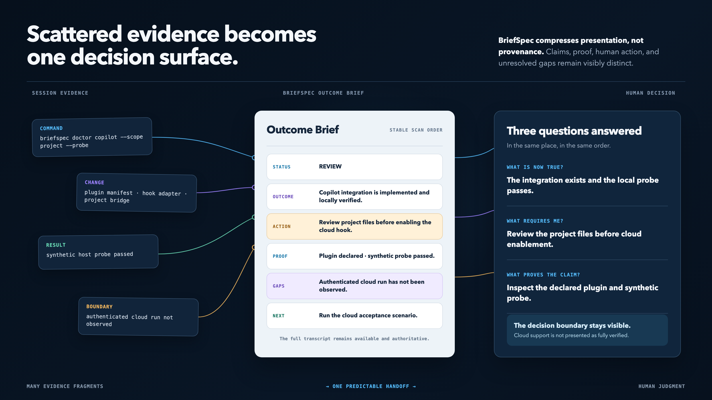
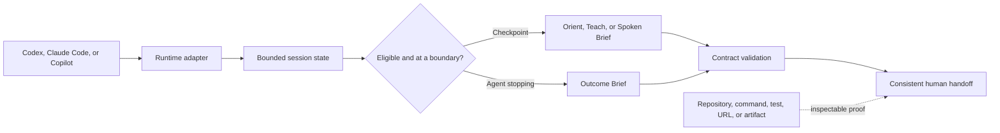

# BriefSpec

## Your agents can think differently. You should not have to read differently.

BriefSpec gives Codex, Claude Code, and GitHub Copilot a shared presentation
contract. It turns irregular agent sessions into a predictable outcome at the
end and an optional checkpoint when you need to orient, understand, or listen.

**Same fields. Same order. Preserved evidence. Less mental reload.**

[](https://www.python.org/)
[](https://github.com/luanmorenomaciel/briefspec/releases/tag/v0.2.1)
[](LICENSE)


> Different agents in. One predictable human handoff out.

BriefSpec standardizes the handoff, not the agent's reasoning. It does not make
every answer shorter. It makes every important answer legible.

## Install

BriefSpec requires Python 3.11 or later. Install the command with
[uv](https://docs.astral.sh/uv/):

```bash
uv tool install git+https://github.com/luanmorenommaciel/briefspec.git@v0.2.1
```

Preview the changes, install all three runtimes, and run the synthetic hook
probe:

```bash
briefspec install all --dry-run
briefspec install all
briefspec doctor all --probe
```

Install only one runtime:

```bash
briefspec install codex
briefspec install claude
briefspec install copilot
```

The default scope is `user`. To keep the integration inside one repository:

```bash
briefspec install all --scope project --project /path/to/repository
briefspec doctor all --scope project --project /path/to/repository --probe
```

Project-scoped Copilot installation also creates the network-free bridge used by
Copilot cloud coding agents:

```text
.agents/skills/{outcome-brief,session-checkpoint}/
.github/briefspec/briefspec.pyz
.github/hooks/briefspec.json
.github/instructions/briefspec.instructions.md
```

The installer merges lifecycle hooks instead of replacing the host file. It
refuses to overwrite foreign skill files or malformed configuration, restores
the prior files if installation fails, records what it owns, and preserves
locally modified files during uninstall.

The tagged URL is intentional: it installs a versioned release instead of
whatever happens to be on `main`. Repository-level immutable-release
protection is a separate GitHub setting. For development from a local checkout,
use `uv tool install .`.

## The problem

Good agent output can still be exhausting to consume.

Once several agents are running, generation is no longer the only bottleneck.
Re-entry becomes the bottleneck. One response begins with a narrative. Another
hides the decision below a test log. A third mixes completed work, caveats, and
suggested work into the same paragraph.

Before acting, you must first discover how to read the answer.


> Same work. On the left, you search for the signal. On the right, the signal
> arrives in a shape your brain already knows.

BriefSpec makes that last mile predictable. It keeps the agent's full work
available while giving the human handoff a stable shape.

## From transcript archaeology to an actionable handoff

Without BriefSpec, an agent can give you 1,500 accurate words while leaving
three expensive questions unanswered:

- What is now true?
- What requires me?
- What proves the claim?



> Illustrative output comparison, not a verification record. The facts stay the
> same; BriefSpec changes their reading cost.

With BriefSpec, substantive work closes like this:

```markdown
<!-- briefspec:outcome:v1 -->
## Outcome Brief

Status: REVIEW
Outcome: The Copilot plugin, project bridge, and hook adapter are implemented.
Human action: Review the generated repository files before enabling the cloud hook.

Proof:
- [direct/info] `plugin.json` — declares the Copilot skills and hooks
- [direct/pass] `briefspec doctor copilot --scope project --probe` → synthetic hook passed

Gaps:
- An authenticated Copilot cloud run has not been observed in this environment.

Next:
- Run the cloud acceptance scenario and retain its run URL.

Open:
- Whether cloud checkpoints should persist beyond the job.
<!-- /briefspec -->
```

You can scan the opening fields and act. Proof and unresolved boundaries remain
visible instead of being compressed into false certainty.

## Two skills, four reading experiences

### `outcome-brief`

A stable end-of-task contract:

1. **Status** — `DONE`, `REVIEW`, `DECIDE`, `BLOCKED`, or `FAILED`
2. **Outcome** — what is now true
3. **Human action** — what requires you, if anything
4. **Proof** — up to five inspectable references
5. **Gaps** — what remains incomplete or unproved
6. **Next** — up to three useful next actions
7. **Open** — up to three unresolved decisions or questions

The validator enforces the field order and status semantics. For example,
`DONE` cannot carry required human action or unresolved gaps, while `DECIDE`
must identify both the required action and the open decision.

### `session-checkpoint`

A checkpoint for long, dense, or interruption-prone sessions. It renders the
same bounded session state for three different needs:

- **Orient** — a 30–45 second operational scan: where we are, what changed, and
  the next move.
- **Teach** — a plain-language mental model: what changed, why it matters, an
  example, and the watch-outs.
- **Spoken Brief** — an 80–240 word sequential script designed to be heard.
  Dense paths and evidence remain in a separate screen-only field.

Spoken Brief produces speech-oriented text; it does not generate audio.

Time or interaction volume can make a checkpoint eligible. They do not force an
interruption. BriefSpec delivers an automatic checkpoint only when the host
reaches a lifecycle boundary.

## How it works



The host integrations normalize these lifecycle events when the host provides
them:

- session start,
- user prompt,
- completed tool use,
- pre-compaction,
- and agent stop.

BriefSpec records bounded operational state, applies eligibility and cooldown
rules, and injects guidance at the next available boundary. In `enforce` or
`auto` policy, an invalid terminal handoff can trigger one corrective pass. A
repair guard prevents a recursive stop-hook loop.

Hooks fail open: an internal BriefSpec error is reported to standard error and
the host receives an empty decision rather than a blocked session.

## Repository map

```text
skills/
  outcome-brief/          Stable terminal handoff
  session-checkpoint/     Orient, Teach, and Spoken Brief
src/briefspec/
  adapters/               Host payload normalization
  hooks.py                Safe-boundary and one-repair control
  installers.py           Transactional user/project integration
schemas/                  Portable machine-readable contracts
hooks/                    Native plugin hook definitions
integrations/copilot/     VS Code and cloud-agent bridge assets
pilots/apex/              Experience scenarios and acceptance fixtures
scripts/                  Hook entrypoint, pilot, and release verification
tests/                    Behavioral, compatibility, privacy, and failure tests
docs/                     Theory, architecture, installation, and evidence
```

## Runtime support

“Copilot support” is not one surface. BriefSpec documents the boundary instead
of implying identical capabilities everywhere.

| Surface | Installation | Outcome Brief | Session Checkpoint | Boundary |
| --- | --- | --- | --- | --- |
| Codex | User or project | Skill + lifecycle policy | Orient, Teach, Spoken | Project hooks resolve from the Git root and still require host trust |
| Claude Code | User or project | Skill + lifecycle policy | Orient, Teach, Spoken | Uses Claude settings hooks and shared skills |
| GitHub Copilot CLI | User or project | Skill + lifecycle policy | Orient, Teach, Spoken | A live host check requires the authenticated `copilot` executable |
| VS Code Copilot agent mode | Project assets | Skill/instruction surface | Host-dependent | Agent plugins and some customization surfaces remain Preview; behavior follows the installed VS Code version |
| Copilot cloud coding agent | Project bridge | Repository instruction + stop hook | Job-bound checkpoint | Runs from checked-in, network-free files in an ephemeral job; personal plugins are not inherited |
| GitHub.com Chat and Copilot code review | Not installed | Manual format only | Not automated | No BriefSpec lifecycle integration is claimed |

`briefspec doctor --probe` validates the installed bundle with a synthetic host
event. It does not claim that an authenticated external service executed the
hook.

For current host behavior, consult the primary platform documentation:
[GitHub Copilot CLI plugins](https://docs.github.com/en/copilot/reference/copilot-cli-reference/cli-plugin-reference),
[GitHub Copilot hooks](https://docs.github.com/en/copilot/reference/hooks-reference),
and [VS Code agent plugins](https://code.visualstudio.com/docs/agent-customization/agent-plugins).

## Validate a brief

BriefSpec validates its bounded Markdown contracts without interpreting the
surrounding response:

```bash
briefspec validate auto path/to/handoff.md
briefspec validate outcome path/to/outcome.md --json
briefspec validate checkpoint path/to/checkpoint.md --mode spoken
```

Read from standard input with `-`:

```bash
briefspec validate auto -
```

The markers are intentional:

```text
<!-- briefspec:outcome:v1 -->
...
<!-- /briefspec -->
```

They let the validator find the contract without forcing the rest of the
agent's response into a rigid schema.

## Configure the experience

Create user configuration:

```bash
briefspec config init
briefspec config show
```

Create `.briefspec.toml` in a project:

```bash
briefspec config init --scope project --project /path/to/repository
```

Project values override user values. `BRIEFSPEC_HOME` can relocate the local
state directory; otherwise BriefSpec follows `XDG_STATE_HOME` when set and falls
back to `~/.local/state/briefspec`.

The generated configuration contains the complete v0.1 policy surface:

```toml
[checkpoint]
policy = "suggest" # off | manual | suggest | auto
default_mode = "orient" # orient | teach | spoken
elapsed_minutes = 12
turns = 8
assistant_chars = 16000
tool_calls = 12
cooldown_minutes = 6
minimum_turns_after_checkpoint = 2

[outcome]
policy = "suggest" # off | suggest | enforce
one_repair = true

[state]
retention_days = 14
```

Checkpoint policy:

- `off` — no lifecycle guidance for that feature.
- `manual` — checkpoints appear only when explicitly requested.
- `suggest` — the host receives guidance at an available boundary.
- `auto` — a due checkpoint can request one corrective terminal pass.

Outcome policy:

- `off` — no lifecycle outcome guidance; explicit skill use remains available.
- `suggest` — the Outcome Brief contract is supplied as session context.
- `enforce` — a missing or invalid Outcome Brief can request one corrective
  terminal pass.

Eligibility is satisfied when any enabled threshold is reached. Cooldown and
minimum-turn rules suppress repetitive checkpoints.

## Inspect and maintain local state

BriefSpec stores session counters and timestamps, not raw prompts, tool output,
or full transcripts.

```bash
briefspec state list
briefspec state list --json
briefspec state prune --older-than 14 --dry-run
briefspec state prune --older-than 14
briefspec state reset --runtime codex --session SESSION_ID
```

State files are written atomically with private permissions. Transcript reading,
when a host provides a transcript path at stop time, is limited to the final
256 KiB and refuses symlinks.

## Safety and evidence invariants

BriefSpec compresses presentation, not provenance.

- A brief is never more authoritative than its source.
- A passing syntax check does not prove a live integration.
- A local commit does not prove publication.
- Planned work is not completed work.
- Direct, derived, and reported evidence must remain distinguishable.
- Unknown or unverified state is a gap, not a reason to infer success.
- Hooks fail open on internal errors.
- A repair request is attempted at most once per turn.
- Hook input is bounded to 1 MiB.
- Session state never contains raw prompt or tool-result content.
- Installation refuses destructive overwrite of foreign files.
- Uninstall uses receipts and preserves files modified after installation.
- Project-scoped Copilot execution is self-contained and does not require a
  runtime package download inside the cloud job.
- Nothing is silently ingested into Nexo, Obsidian, or another knowledge
  system.

The JSON schemas in [`schemas/`](schemas/) define the portable data contracts;
the Markdown validator enforces their human-facing counterpart.

## A presentation layer, not another second brain

BriefSpec does not try to remember your life.

It does not become the canonical store for project knowledge, ingest
conversations into a permanent knowledge graph, approve decisions, or replace
repositories, issue trackers, transcripts, and evidence systems.

It keeps only the bounded operational state needed to recognize session length,
avoid duplicates, apply cooldowns, and prevent repair loops. The original
repository, command output, document, or host transcript remains authoritative.

If you use Nexo, Obsidian, or another knowledge system, you can explicitly
promote a BriefSpec artifact into it. That is a separate, deliberate action.

```text
authoritative work → BriefSpec presentation contract → human judgment
```

Read [the design theory](docs/theory.md) for the cognitive model, research
boundaries, and rationale behind the contracts.

## Documentation

- [Installation](docs/installation.md) — portable and native plugin paths,
  upgrades, clean-room checks, and uninstall.
- [Configuration](docs/configuration.md) — policies, thresholds, state, and
  precedence.
- [Architecture](docs/architecture.md) — event normalization, triggers,
  privacy, repair, and packaging.
- [Compatibility](docs/compatibility.md) — host discovery, lifecycle
  differences, and release gates.
- [Verification record](docs/verification.md) — deterministic, native-host,
  live-host, and externally pending evidence for v0.2.1.
- [Design theory](docs/theory.md) — cognitive rationale, research boundaries,
  and falsifiable product hypotheses.
- [Apex pilot](pilots/apex/README.md) — synthetic experience scenarios and
  evaluation questions.
- [Contributing](CONTRIBUTING.md) and [Security](SECURITY.md) — development
  gates and the trust model.

## Uninstall

Preview removal:

```bash
briefspec uninstall all --dry-run
```

Remove a user installation:

```bash
briefspec uninstall all
```

Remove one project installation:

```bash
briefspec uninstall copilot --scope project --project /path/to/repository
```

BriefSpec removes receipt-owned files only when their content still matches the
installed hash. It removes its own entries from merged hook files and leaves
unrelated configuration intact.

## Development

Clone the repository and install the locked development environment:

```bash
git clone https://github.com/luanmorenommaciel/briefspec.git
cd briefspec
uv sync --group dev
```

Run the quality gates:

```bash
uv run ruff check .
uv run pytest --cov=briefspec --cov-report=term-missing
uv build
```

Exercise a clean project-scoped installation without touching real host
configuration:

```bash
trial_dir="$(mktemp -d)"
BRIEFSPEC_HOME="$trial_dir/state" \
  uv run briefspec install all --scope project --project "$trial_dir/project"
BRIEFSPEC_HOME="$trial_dir/state" \
  uv run briefspec doctor all --scope project --project "$trial_dir/project" --probe
BRIEFSPEC_HOME="$trial_dir/state" \
  uv run briefspec uninstall all --scope project --project "$trial_dir/project"
```

The package has no runtime dependencies. The installed per-host zipapp contains
the same core used by the development CLI.

## Honest limits

- A consistent format cannot make an unsupported claim true.
- A checkpoint cannot recover evidence the host never exposed.
- Lifecycle automation depends on the events supported by each host version.
- Spoken Brief is text until a separate text-to-speech system renders it.
- Automatic checkpoint thresholds are heuristics and remain configurable.
- BriefSpec reduces reading friction; high-risk changes still deserve direct
  inspection.

## License

[MIT](LICENSE)
