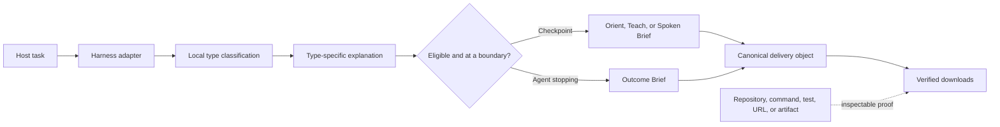

# Brief-Spec

## Your agents can think differently. You should not have to read differently.

Brief-Spec gives Codex, Claude Code, OMP, Grok Build, Kimi Code, and experimental
harnesses a shared, type-aware presentation and verified-delivery contract. It
turns irregular agent sessions into a predictable explanation, terminal outcome,
and optional checkpoint when you need to orient, understand, or listen.

**Same fields. Same order. Preserved evidence. Less mental reload.**

[](https://www.python.org/)
[](docs/verification.md)
[](https://github.com/luanmorenommaciel/brief-spec/releases/tag/v0.2.0)
[](LICENSE)


> Different agents in. One predictable human handoff out.

Brief-Spec standardizes the explanation and handoff, not the agent's reasoning. It does not make
every answer shorter. It makes every important answer legible.

## Feature map

Brief-Spec `0.5.0` is a dependency-free core, three portable skills, a canonical delivery model,
optional renderers, and a transactional cross-harness installer. Every downloadable form is a
projection of the same bounded brief; no renderer independently rewrites the result.

| Area | What is included | Primary interface |
| --- | --- | --- |
| Canonical identity | **Brief-Spec**, `brief-spec` CLI/distribution, `brief_spec` import, `BRIEF_SPEC_HOME`, and `~/.local/state/brief-spec` | `brief-spec --version` |
| `0.x` compatibility | `briefspec` CLI/import, legacy markers, schemas, receipts, state, environment variable, and renderer entry-point group remain readable | `briefspec`, `brief-spec install` |
| Local task routing | Deterministic, bounded, zero-network classification with explicit → host → inferred → fallback precedence, confidence, decision IDs, sticky tasks, and explicit pivots | `brief-spec classify`, `brief-spec types` |
| Eight work types | `general`, `exploration`, `review`, `implementation`, `debugging`, `planning`, `research`, and `operations`, each with an ordered explanation profile | `brief-spec types show TYPE` |
| Open subjects | Built-in vocabulary for pull requests, codebases, bugs, features, releases, incidents, security, dependencies, and other normalized slugs | `brief-spec classify --subject SUBJECT` |
| Terminal handoff | Outcome Brief with five honest statuses and fixed Status → Outcome → Human action → Proof → Gaps → Next → Open order | `outcome-brief`, `brief-spec validate` |
| Reading experiences | Orient, Teach, and Spoken Checkpoints, plus the terminal Outcome experience | `session-checkpoint` |
| Canonical delivery | `brief-spec-delivery/2.0` with source/harness/model metadata, classification, explanation, provenance, artifacts, and work items | `brief-spec export` |
| Core downloads | Deterministic Markdown, canonical JSON, self-contained offline HTML, ZIP bundles, spoken text, and SSML | `brief-spec export`, `brief-spec bundle` |
| Optional downloads | Playwright/Chromium PDF and MP3 audio through local macOS speech or explicitly consented OpenAI speech | `brief-spec export --formats pdf,audio` |
| Integrity metadata | Ordered bundle manifests, SHA-256 hashes, fixed ZIP metadata, and external delivery receipts | `manifest.json`, receipt JSON |
| Evidence and provenance | Direct/derived/reported evidence, `kind=` hints, safe file/Git/URL locators, access classes, expiry, and provider-neutral Exa/Tavily/Firecrawl records | canonical JSON and schemas |
| Progressive verification | Structural, resolved, rendered, and delivered levels; zero network and no renderer plugins by default | `brief-spec verify` |
| Explicit local delivery | Atomic copy to a named directory with an independently verifiable receipt; no hidden email/chat sending | `brief-spec deliver` |
| Cross-harness setup | User/project installations for Codex, Claude Code, OMP, Grok Build, Kimi Code, Copilot, Cursor, and Goose | `brief-spec setup` |
| Installation safety | Detected-only `setup all`, `--require`, dry runs, ownership receipts, atomic writes, multi-host rollback, drift detection, and modified-file preservation | `brief-spec setup`, `brief-spec uninstall` |
| Diagnostics | Capability inventory, version alignment, all-scope inspection, synthetic probes, safe repair, and renderer prerequisite checks | `brief-spec capabilities`, `brief-spec doctor` |
| Policy and state | User/project configuration, checkpoint/outcome/typing policies, bounded counters, retention, pruning, and reset | `brief-spec config`, `brief-spec state` |
| Security boundaries | Fail-open hooks, one-repair guard, bounded inputs/archives, traversal and symlink protection, SSRF-safe public URL checks, and no command evidence execution | validator and verifier |
| Portable contracts | Outcome, Checkpoint, evidence, delivery, manifest, and receipt JSON Schemas plus an offline compound schema bundle | [`schemas/`](schemas/) |
| Release assurance | Source/wheel projection checks, browser/PDF/audio gates, clean-room wheel/sdist installs, live-host evidence, exact-SHA authorization, checksums, and restart-safe publishing workflow | [`docs/verification.md`](docs/verification.md) |

## What is new in `0.5.0`

The `0.5.0` source candidate consolidates the unpublished `0.3.0` delivery work and `0.4.0`
renderer work into one release. No intermediate `0.3.0` or `0.4.0` package will be published.

| Change | What was added or improved | Current candidate evidence |
| --- | --- | --- |
| Brief-Spec naming | Canonical hyphenated product, distribution, CLI, import, state, and renderer names with complete `0.x` forwarding compatibility | Source and final wheel checks pass |
| Type-aware explanations | Eight profiles, open subjects, deterministic classification, confidence/origin records, sticky tasks, and typed Markdown/delivery metadata | Classification and semantic matrix tests pass |
| Delivery Core | One canonical object now drives exports, bundles, manifests, receipts, provenance, artifacts, and work items | Deterministic and clean-room gates pass |
| Complete download set | Markdown, JSON, HTML, ZIP, spoken text, SSML, optional PDF, and optional audio | Browser, PDF, and local-audio E2E pass |
| Safer verification | Offline/no-plugin defaults, public-address checks, archive and file limits, workspace escape protection, and cumulative verification levels | Security regressions and release checks pass |
| Cross-harness registry | Five required live-verified harnesses plus three explicitly experimental adapters | Codex 8/8, Claude 8/8, OMP 4/4, Grok 4/4, Kimi 4/4 |
| Native Grok lifecycle | Passive hook classification, camelCase event support, exact one-pass Stop repair, and bounded native read/edit implementation gate | Grok required matrix passes 4/4 |
| Transactional rollout | Detected-only setup, named requirements, atomic all-host rollback, receipt-owned uninstall, modified-file preservation, and global/project drift repair | User and project rollback/reapply drills pass |
| Portable schemas | Canonical immutable release-asset identifiers, legacy read aliases, and offline compound validation | Schema bundle and differential validation pass |
| Verifiable release path | Build-once distributions, SHA-256 manifest, sanitized live evidence, exact-SHA release authorization, Trusted Publishing workflow, and digest comparison | Local candidate authorized; hosted publication gates remain open |

### Release lineage

| Version | State | Headline |
| --- | --- | --- |
| `0.5.0` | Locally verified candidate | Naming, work types, Delivery Core, optional renderers, five live-verified harnesses, security hardening, and release evidence |
| `0.4.0` | Unpublished; folded into `0.5.0` | Optional PDF and audio renderer packages |
| `0.3.0` | Unpublished; folded into `0.5.0` | Canonical delivery, deterministic downloads, manifests, receipts, and progressive verification |
| `0.2.1` | Unpublished; folded into `0.5.0` | Project-hook, validation, installation, and release-workflow hardening |
| `0.2.0` | Latest GitHub release | Checkpoint cooldown and Claude project installation corrections |
| `0.1.0` | Historical GitHub release | Outcome Brief, Session Checkpoint, initial adapters, installer, doctor, and state control |

See the full [changelog](CHANGELOG.md) and the generated
[verification truth boundary](docs/verification.md). “Locally verified” does not mean hosted or
published: `v0.5.0` still requires exact-SHA hosted CI and the account-owned publication gates.

## Install

Brief-Spec requires Python 3.11 or later. The current truth boundary is:

- Public release: `v0.2.0` on GitHub.
- Source candidate: `v0.5.0` in this checkout; Codex, Claude, OMP, Grok, and
  Kimi pass the required live matrix. Publication still waits for exact-SHA
  hosted CI, GitHub Release, and PyPI gates.

Install the latest GitHub release with [uv](https://docs.astral.sh/uv/). The repository is currently
private, so this command requires GitHub credentials authorized for the repository:

```bash
uv tool install git+https://github.com/luanmorenommaciel/brief-spec.git@v0.2.0
```

Dogfood the candidate from this checkout:

```bash
uv tool install --force --reinstall . \
  --with ./packages/briefspec-renderer-pdf \
  --with ./packages/briefspec-renderer-audio
brief-spec setup all --scope user --require codex,claude,omp,grok,kimi
brief-spec doctor all --scope user --probe --all-scopes
```

Install only one runtime:

```bash
brief-spec setup codex
brief-spec setup claude
brief-spec setup omp
brief-spec setup grok
brief-spec setup kimi
```

The default scope is `user`. To keep the integration inside one repository:

```bash
brief-spec setup all --scope project --project /path/to/repository
brief-spec doctor all --scope project --project /path/to/repository --probe
```

Project-scoped Copilot installation also creates the network-free bridge used by
Copilot cloud coding agents:

```text
.agents/skills/{brief-spec,outcome-brief,session-checkpoint}/
.github/brief-spec/brief-spec.pyz
.github/hooks/brief-spec.json
.github/instructions/brief-spec.instructions.md
```

The installer merges lifecycle hooks instead of replacing the host file. It
refuses to overwrite foreign skill files or malformed configuration, restores
the prior files if installation fails, records what it owns, and preserves
locally modified files during uninstall.

The tagged URL is intentional: it installs a versioned release instead of
whatever happens to be on `main`. Repository-level immutable-release
protection is a separate GitHub setting. For development from a local checkout,
use `uv tool install .`.

## The problem

Good agent output can still be exhausting to consume.

Once several agents are running, generation is no longer the only bottleneck.
Re-entry becomes the bottleneck. One response begins with a narrative. Another
hides the decision below a test log. A third mixes completed work, caveats, and
suggested work into the same paragraph.

Before acting, you must first discover how to read the answer.


> Same work. On the left, you search for the signal. On the right, the signal
> arrives in a shape your brain already knows.

Brief-Spec makes that last mile predictable. It keeps the agent's full work
available while giving the human handoff a stable shape.

## From transcript archaeology to an actionable handoff

Without Brief-Spec, an agent can give you 1,500 accurate words while leaving
three expensive questions unanswered:

- What is now true?
- What requires me?
- What proves the claim?


> Illustrative output comparison, not a verification record. The facts stay the
> same; Brief-Spec changes their reading cost.

With Brief-Spec, substantive work closes like this:

```markdown
<!-- briefspec:outcome:v1 -->
## Outcome Brief

Status: REVIEW
Outcome: The Copilot plugin, project bridge, and hook adapter are implemented.
Human action: Review the generated repository files before enabling the cloud hook.

Proof:
- [direct/info] `.github/plugin/marketplace.json` — declares the Copilot plugin source
- [direct/pass] `brief-spec doctor copilot --scope project --probe` → synthetic hook passed

Gaps:
- An authenticated Copilot cloud run has not been observed in this environment.

Next:
- Run the cloud acceptance scenario and retain its run URL.

Open:
- Whether cloud checkpoints should persist beyond the job.
<!-- /briefspec -->
```

You can scan the opening fields and act. Proof and unresolved boundaries remain
visible instead of being compressed into false certainty.

## Three skills, eight work types, four reading experiences

### `brief-spec`

The universal router classifies substantive tasks locally and loads exactly one
compact explanation profile. No network request or hidden model call is used.

| Type | Explanation order |
| --- | --- |
| `general` | Answer, rationale, next action |
| `exploration` | Question, system map, entry points, flow, unknowns, next probe |
| `review` | Scope, verdict, findings, risk, validation, recommendation |
| `implementation` | Intent, changes, resulting behavior, verification, tradeoffs |
| `debugging` | Symptom, root cause, fix, regression protection, residual risk |
| `planning` | Goal, decisions, approach, sequence, gates |
| `research` | Question, synthesis, evidence quality, limitations, recommendation |
| `operations` | Event, impact, current state, actions, recovery, follow-up |

Use `brief-spec types list`, `brief-spec types show review`, or classify bounded
text without storing it:

```bash
brief-spec classify - --subject pull-request --json
```

### `outcome-brief`

A stable end-of-task contract:

1. **Status** — `DONE`, `REVIEW`, `DECIDE`, `BLOCKED`, or `FAILED`
2. **Outcome** — what is now true
3. **Human action** — what requires you, if anything
4. **Proof** — up to five inspectable references
5. **Gaps** — what remains incomplete or unproved
6. **Next** — up to three useful next actions
7. **Open** — up to three unresolved decisions or questions

The validator enforces the field order and status semantics. For example,
`DONE` cannot carry required human action or unresolved gaps, while `DECIDE`
must identify both the required action and the open decision.

### `session-checkpoint`

A checkpoint for long, dense, or interruption-prone sessions. It renders the
same bounded session state for three different needs:

- **Orient** — a 30–45 second operational scan: where we are, what changed, and
  the next move.
- **Teach** — a plain-language mental model: what changed, why it matters, an
  example, and the watch-outs.
- **Spoken Brief** — an 80–240 word sequential script designed to be heard.
  Dense paths and evidence remain in a separate screen-only field.

Spoken Brief produces speech-oriented text in the core package. The optional
audio renderer can turn only that bounded Script into a verified MP3.

Time or interaction volume can make a checkpoint eligible. They do not force an
interruption. Brief-Spec delivers an automatic checkpoint only when the host
reaches a lifecycle boundary.

## How it works



The host integrations normalize these lifecycle events when the host provides
them:

- session start,
- user prompt,
- completed tool use,
- pre-compaction,
- and agent stop.

Brief-Spec records bounded operational state, applies eligibility and cooldown
rules, and injects guidance at the next available boundary. In `enforce` or
`auto` policy, an invalid terminal handoff can trigger one corrective pass. A
repair guard prevents a recursive stop-hook loop.

Hooks fail open: an internal Brief-Spec error is reported to standard error and
the host receives an empty decision rather than a blocked session.

## Repository map

```text
skills/
  brief-spec/            Type router and eight compact profiles
  outcome-brief/          Stable terminal handoff
  session-checkpoint/     Orient, Teach, and Spoken Brief
src/briefspec/
  adapters/               Host payload normalization
  delivery.py             Canonical envelope and core renderers
  verification.py         Structural through delivered verification
  renderers.py            Optional renderer discovery
  hooks.py                Safe-boundary and one-repair control
  installers.py           Transactional user/project integration
packages/                 Version-aligned PDF and audio renderers
schemas/                  Portable machine-readable contracts
hooks/                    Native plugin hook definitions
integrations/copilot/     VS Code and cloud-agent bridge assets
pilots/apex/              Experience scenarios and acceptance fixtures
scripts/                  Hook entrypoint, pilot, and release verification
tests/                    Behavioral, compatibility, privacy, and failure tests
docs/                     Theory, architecture, installation, and evidence
```

## Harness support

“Copilot support” is not one surface. Brief-Spec documents the boundary instead
of implying identical capabilities everywhere.

| Surface | Installation | Outcome Brief | Session Checkpoint | Boundary |
| --- | --- | --- | --- | --- |
| Codex | User or project | Skill + lifecycle policy | Orient, Teach, Spoken | Project hooks resolve from the Git root and still require host trust |
| Claude Code | User or project | Skill + lifecycle policy | Orient, Teach, Spoken | Uses Claude settings hooks and shared skills |
| OMP | User or project | Native skills + managed extension | Orient, Teach, Spoken | Uses native turn, compaction, tool, and session-stop events |
| Grok Build | User or project; live-verified | Native `.grok/skills` + hooks | Orient, Teach, Spoken | Native passive classification plus one bounded Stop repair; implementation gate permits only native read/edit tools in a disposable repository |
| Kimi Code | User plugin; project skills | Managed plugin + lifecycle hooks | Orient, Teach, Spoken | Project lifecycle requires the user-wide plugin |
| GitHub Copilot CLI | User or project; experimental | Skill + lifecycle policy | Orient, Teach, Spoken | Promotion waits for authenticated live gates |
| Cursor Agent | User or project; experimental | Skill + fixture-tested hooks | Host-dependent | Promotion waits for authenticated live gates |
| Goose | User or project; experimental | Skill only | Manual boundary | No native lifecycle automation is claimed |
| VS Code Copilot agent mode | Project assets | Skill/instruction surface | Host-dependent | Agent plugins and some customization surfaces remain Preview; behavior follows the installed VS Code version |
| Copilot cloud coding agent | Project bridge | Repository instruction + stop hook | Job-bound checkpoint | Runs from checked-in, network-free files in an ephemeral job; personal plugins are not inherited |
| GitHub.com Chat and Copilot code review | Not installed | Manual format only | Not automated | No Brief-Spec lifecycle integration is claimed |

`brief-spec doctor --probe` validates the installed bundle with a synthetic host
event. It does not claim that an authenticated external service executed the
hook.

For current host behavior, consult the primary platform documentation:
[GitHub Copilot CLI plugins](https://docs.github.com/en/copilot/reference/copilot-cli-reference/cli-plugin-reference),
[GitHub Copilot hooks](https://docs.github.com/en/copilot/reference/hooks-reference),
and [VS Code agent plugins](https://code.visualstudio.com/docs/agent-customization/agent-plugins).

## Validate a brief

Brief-Spec validates its bounded Markdown contracts without interpreting the
surrounding response:

```bash
brief-spec validate auto path/to/handoff.md
brief-spec validate outcome path/to/outcome.md --json
brief-spec validate checkpoint path/to/checkpoint.md --mode spoken
```

Read from standard input with `-`:

```bash
brief-spec validate auto -
```

The markers are intentional:

```text
<!-- briefspec:outcome:v1 -->
...
<!-- /briefspec -->
```

They let the validator find the contract without forcing the rest of the
agent's response into a rigid schema.

## Export and verify deliveries

Brief-Spec parses the bounded contract once and renders every download from one
canonical delivery object:

```bash
brief-spec export handoff.md \
  --formats markdown,json,html \
  --output-dir delivery/

brief-spec bundle handoff.md --output handoff.zip
brief-spec verify handoff.zip --level rendered --offline --no-plugins
brief-spec deliver handoff.zip --to /path/to/deliveries/
brief-spec verify /path/to/deliveries/handoff.zip.receipt.json --level delivered
```

Markdown remains human-readable, JSON is the canonical machine contract, HTML
is self-contained and offline, and ZIP members are checked against
`manifest.json`. Delivery receipts live outside the ZIP so their hash can
attest to the delivered bytes without becoming self-referential.

Evidence can retain research provenance without coupling the core package to a
provider SDK. A canonical envelope can name Exa, Tavily, Firecrawl, local files,
or another source together with its locator, retrieval time, access class, and
content hash.

Verification levels are cumulative:

- `structural` checks the bounded contract, canonical schema, or bundle shape.
- `resolved` checks safe file and Git object references with zero network by
  default; `--consent-network` enables bounded public-URL checks, while commands
  are never executed.
- `rendered` checks output-specific integrity and offline HTML semantics.
- `delivered` checks an external receipt against the destination bytes.

Optional candidate renderer packages add PDF and MP3 downloads:

```bash
uv tool install --force . \
  --with ./packages/briefspec-renderer-pdf \
  --with ./packages/briefspec-renderer-audio
brief-spec doctor codex --fix

brief-spec export spoken.md --formats html,audio --output-dir delivery/ \
  --audio-provider macos --voice Samantha
brief-spec export spoken.md --formats audio --output-dir delivery/ \
  --audio-provider openai --voice marin --consent-network
```

The macOS provider uses `say` plus `ffmpeg` and never falls back to the network.
The OpenAI provider requires an explicit provider, network consent, and an
`OPENAI_API_KEY` supplied at runtime; credentials are never written to Brief-Spec
artifacts or receipts. The candidate follows OpenAI's current
[text-to-speech guide](https://developers.openai.com/api/docs/guides/text-to-speech):
`gpt-4o-mini-tts` with the recommended `marin` voice by default.

## Configure the experience

Create user configuration:

```bash
brief-spec config init
brief-spec config show
```

Create `.brief-spec.toml` in a project:

```bash
brief-spec config init --scope project --project /path/to/repository
```

Project values override user values. `BRIEF_SPEC_HOME` is canonical and can relocate the local
state directory; otherwise Brief-Spec follows `XDG_STATE_HOME` when set and falls
back to `~/.local/state/brief-spec`. The legacy `BRIEFSPEC_HOME` remains readable
throughout the `0.x` line.

The generated configuration contains the complete v0.1 policy surface:

```toml
[checkpoint]
policy = "suggest" # off | manual | suggest | auto
default_mode = "orient" # orient | teach | spoken
elapsed_minutes = 12
turns = 8
assistant_chars = 16000
tool_calls = 12
cooldown_minutes = 6
minimum_turns_after_checkpoint = 2

[outcome]
policy = "suggest" # off | suggest | enforce
one_repair = true

[typing]
enabled = true
activation = "substantive"
default_type = "general"
sticky = true

[state]
retention_days = 14
```

Checkpoint policy:

- `off` — no lifecycle guidance for that feature.
- `manual` — checkpoints appear only when explicitly requested.
- `suggest` — the host receives guidance at an available boundary.
- `auto` — a due checkpoint can request one corrective terminal pass.

Outcome policy:

- `off` — no lifecycle outcome guidance; explicit skill use remains available.
- `suggest` — the Outcome Brief contract is supplied as session context.
- `enforce` — a missing or invalid Outcome Brief can request one corrective
  terminal pass.

Eligibility is satisfied when any enabled threshold is reached. Cooldown and
minimum-turn rules suppress repetitive checkpoints.

## Inspect and maintain local state

Brief-Spec stores session counters and timestamps, not raw prompts, tool output,
or full transcripts.

```bash
brief-spec state list
brief-spec state list --json
brief-spec state prune --older-than 14 --dry-run
brief-spec state prune --older-than 14
brief-spec state reset --runtime codex --session SESSION_ID
```

State files are written atomically with private permissions. Transcript reading,
when a host provides a transcript path at stop time, is limited to the final
256 KiB and refuses symlinks.

## Safety and evidence invariants

Brief-Spec compresses presentation, not provenance.

- A brief is never more authoritative than its source.
- A passing syntax check does not prove a live integration.
- A local commit does not prove publication.
- Planned work is not completed work.
- Direct, derived, and reported evidence must remain distinguishable.
- Unknown or unverified state is a gap, not a reason to infer success.
- Hooks fail open on internal errors.
- A repair request is attempted at most once per turn.
- Hook input is bounded to 1 MiB.
- Session state never contains raw prompt or tool-result content.
- Installation refuses destructive overwrite of foreign files.
- Uninstall uses receipts and preserves files modified after installation.
- Project-scoped Copilot execution is self-contained and does not require a
  runtime package download inside the cloud job.
- Nothing is silently ingested into Nexo, Obsidian, or another knowledge
  system.

The JSON schemas in [`schemas/`](schemas/) define the portable data contracts.
Canonical `0.5.0` schemas use immutable GitHub release-asset identifiers and
ship as an offline compound bundle; legacy `briefspec.dev` identifiers remain
read aliases through `0.x`. The Markdown validator enforces their human-facing
counterpart.

## A presentation layer, not another second brain

Brief-Spec does not try to remember your life.

It does not become the canonical store for project knowledge, ingest
conversations into a permanent knowledge graph, approve decisions, or replace
repositories, issue trackers, transcripts, and evidence systems.

It keeps only the bounded operational state needed to recognize session length,
avoid duplicates, apply cooldowns, and prevent repair loops. The original
repository, command output, document, or host transcript remains authoritative.

If you use Nexo, Obsidian, or another knowledge system, you can explicitly
promote a Brief-Spec artifact into it. That is a separate, deliberate action.

```text
authoritative work → Brief-Spec presentation contract → human judgment
```

Read [the design theory](docs/theory.md) for the cognitive model, research
boundaries, and rationale behind the contracts.

## Documentation

- [Changelog](CHANGELOG.md) — complete release history, including the unpublished work folded into
  `0.5.0`.
- [Installation](docs/installation.md) — portable and native plugin paths,
  upgrades, clean-room checks, and uninstall.
- [Configuration](docs/configuration.md) — policies, thresholds, state, and
  precedence.
- [Architecture](docs/architecture.md) — event normalization, triggers,
  privacy, repair, and packaging.
- [Verified delivery](docs/delivery.md) — canonical exports, manifests,
  receipts, verification levels, and optional renderers.
- [Compatibility](docs/compatibility.md) — host discovery, lifecycle
  differences, and release gates.
- [Verification record](docs/verification.md) — deterministic, native-host,
  live-host, and publication evidence for the v0.5.0 candidate.
- [Design theory](docs/theory.md) — cognitive rationale, research boundaries,
  and falsifiable product hypotheses.
- [Apex pilot](pilots/apex/README.md) — synthetic experience scenarios and
  evaluation questions.
- [Contributing](CONTRIBUTING.md) and [Security](SECURITY.md) — development
  gates and the trust model.

## Uninstall

Preview removal:

```bash
brief-spec uninstall all --dry-run
```

Remove a user installation:

```bash
brief-spec uninstall all
```

Remove one project installation:

```bash
brief-spec uninstall copilot --scope project --project /path/to/repository
```

Brief-Spec removes receipt-owned files only when their content still matches the
installed hash. It removes its own entries from merged hook files and leaves
unrelated configuration intact.

## Development

Clone the repository and install the locked development environment:

```bash
git clone https://github.com/luanmorenommaciel/brief-spec.git
cd brief-spec
uv sync --group dev
```

Run the quality gates:

```bash
uv run ruff check .
uv run pytest --cov=briefspec --cov-report=term-missing
uv build
```

Exercise a clean project-scoped installation without touching real host
configuration:

```bash
trial_dir="$(mktemp -d)"
BRIEF_SPEC_HOME="$trial_dir/state" \
  uv run brief-spec install all --scope project --project "$trial_dir/project"
BRIEF_SPEC_HOME="$trial_dir/state" \
  uv run brief-spec doctor all --scope project --project "$trial_dir/project" --probe
BRIEF_SPEC_HOME="$trial_dir/state" \
  uv run brief-spec uninstall all --scope project --project "$trial_dir/project"
```

The package has no runtime dependencies. The installed per-host zipapp contains
the same core used by the development CLI.

## Honest limits

- A consistent format cannot make an unsupported claim true.
- A checkpoint cannot recover evidence the host never exposed.
- Lifecycle automation depends on the events supported by each host version.
- Spoken Brief is text until a separate text-to-speech system renders it.
- Automatic checkpoint thresholds are heuristics and remain configurable.
- Brief-Spec reduces reading friction; high-risk changes still deserve direct
  inspection.

## License

[MIT](LICENSE)
