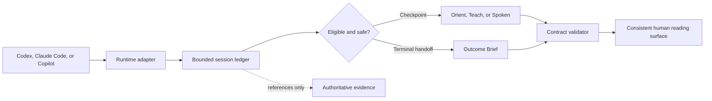

# Architecture

Brief-Spec standardizes the handoff, not the agent's reasoning.

## Responsibilities

### Host agent

- Performs implementation, investigation, or research.
- Reads the relevant skill.
- Synthesizes the human-facing explanation.
- Selects and cites inspectable evidence.

### Brief-Spec core

- Normalizes provider lifecycle payloads.
- Records timestamps, counters, event hashes, and pending state.
- Determines checkpoint eligibility.
- Waits for a safe boundary.
- Validates bounded Markdown contracts.
- Requests at most one repair.
- Installs and diagnoses host integrations.

Brief-Spec never calls a model. It does not reconstruct the agent's reasoning or silently make a
second summary of a summary.

## Event model

Provider events normalize into:

- `session_start`
- `user_prompt`
- `post_tool`
- `pre_compact`
- `agent_stop`
- `error`

The internal model includes runtime, opaque session ID, timestamp, working directory, bounded
assistant text when available, transcript reference when available, stop-loop state, counters, and
a canonical payload hash.

Unknown fields are ignored. Unknown or malformed payloads fail open.

## Trigger policy

Elapsed time, turn count, assistant volume, tool count, a manual request, or context compaction can
make a checkpoint eligible. Eligibility and delivery are separate:

1. An unsafe event records a pending checkpoint.
2. Active work continues.
3. The next agent-stop boundary may render or suggest the checkpoint.
4. Cooldown and minimum-turn rules prevent repetition.
5. A valid terminal Outcome Brief may satisfy an automatic orient checkpoint.

`manual`, `suggest`, and `auto` modes trade automation for interruption risk. `suggest` is the
default.

## Repair guard

In enforce or automatic mode, a known-invalid handoff may block one stop and send a combined repair
instruction to the host. Brief-Spec atomically records the attempt before returning the block. A
second stop is allowed even when invalid. Native `stop_hook_active` signals are honored as an
additional guard.

Hooks are a UX enforcement mechanism, not a security boundary.

## State and privacy

State resolution:

1. `BRIEF_SPEC_HOME`
2. `BRIEFSPEC_HOME` (legacy compatibility)
3. `XDG_STATE_HOME/brief-spec`
4. `~/.local/state/brief-spec`

Doctor continues reading the legacy state directory and migrates receipt-owned state
transactionally when `--fix` is supplied.

Session directory names are SHA-256 hashes of runtime and opaque session ID. Files use private
permissions where supported and atomic replacement. Lock files serialize concurrent event updates.
Corrupt state is quarantined and rebuilt.

Persisted by default:

- provider and opaque session identifiers;
- timestamps and counters;
- checkpoint reasons and mode;
- recent event hashes;
- one-repair state.

Never persisted by default:

- raw prompts;
- full assistant responses;
- transcript contents;
- tool inputs or results;
- environment variables or credentials.

## Installation architecture

The Python wheel force-includes canonical root skills, schemas, hooks, integration templates, and
manifests as package resources. User and project installers materialize those assets, merge hook
configuration, and write a hash-based receipt.

Project-scoped Copilot installation builds a deterministic, stdlib-only `briefspec.pyz`. The cloud
agent can execute it from the cloned repository without package downloads or outbound network. Its
PascalCase hook configuration is shared by VS Code and the cloud agent; the adapter returns both
the native Copilot fields and the VS Code-compatible envelope where the hosts differ.

Uninstall removes Brief-Spec hook entries and receipt-owned files only. Modified and shared files are
preserved. A runtime installation is transactional: a failed write restores preexisting bytes and
removes partial files before surfacing the error.
